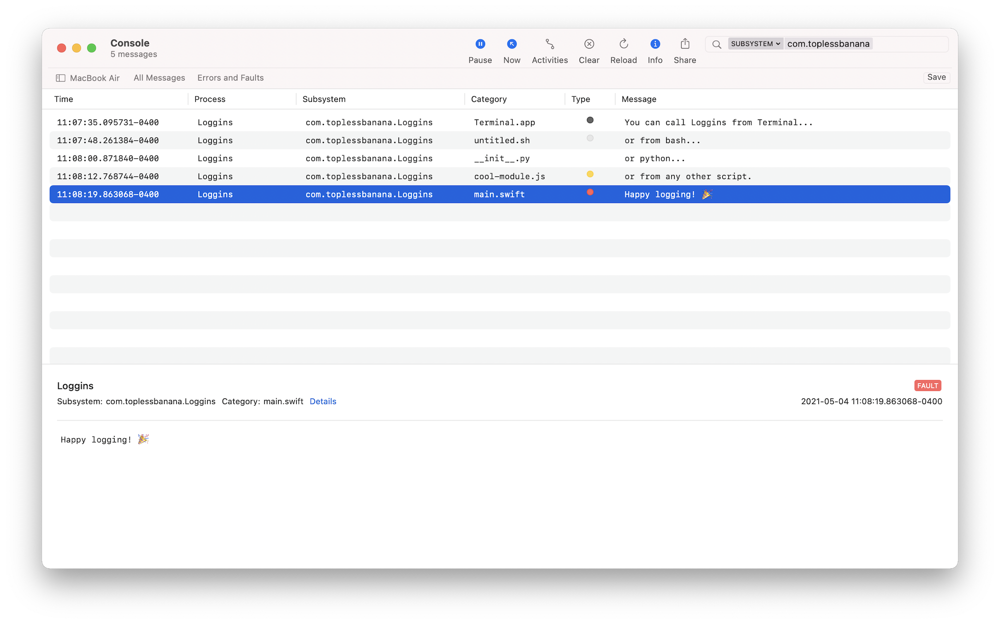

# Loggins

<p align="center">

</p>

Loggins is a command-line utility that writes messages to the unified logging system.

# Usage

Loggins was created to bring Apple's [Logger API](https://developer.apple.com/documentation/os/logger) to general-purpose scripting in a way that's both simple and language-agnostic.

### Examples

Show help information for the command-line utility.

```bash
$ ./Loggins --help
```

Writes a message at the notice (default) log level.

```bash
$ ./Loggins "Highway to the Danger Zone"
```

Writes a message at the debug log level, adding a subsystem and category.

```bash
$ ./Loggins --subsystem "com.toplessbanana.Loggins" --category "Terminal.app" --level "debug" "Gonna take it right into the Danger Zone"
```

Writes a message when called from a script.

```bash
#!/bin/bash

SUBSYSTEM=com.toplessbanana.Loggins
CATEGORY=example.sh

names=("Kenny" "Gary" "Georgia")
count=0

for name in "${names[@]}"
do
	echo "Ride into the Danger Zone, $name."
	((count=count+1))
done

./Loggins --subsystem "$SUBSYSTEM" --category "$CATEGORY" "$count people are in the Danger Zone"

exit 0
```
